# PSP - Tema 1. Programación concurrente

## Indice
- [**Objetivos del Tema**](#objetivos-del-tema)
- [**1.1. Procesos, Programas, hilos**](#11-procesos--programas--hilos)
  * [1.1.2. Programación concurrente](#112-programaci-n-concurrente)
    + [¿Para qué?](#-para-qu--)
    + [Comunicación y sincronización entre procesos](#comunicaci-n-y-sincronizaci-n-entre-procesos)
  * [1.1.3. Servicios e hilos](#113-servicios-e-hilos)
    + [Programa secuencial (Arquitectura Von Newmann)](#programa-secuencial--arquitectura-von-newmann-)
    + [Programa concurrente](#programa-concurrente)
      - [Hilos vs procesos](#hilos-vs-procesos)
      - [Servicios](#servicios)
- [**1.2. Concurrencia**](#12-concurrencia)
  * [1.2.1. Concurrencia vs Paralelismo](#121-concurrencia-vs-paralelismo)
    + [Monoproceso](#monoproceso)
    + [Multiprogramación](#multiprogramaci-n)
    + [Paralelismo](#paralelismo)
  * [1.2.2. Sistemas distribuidos](#122-sistemas-distribuidos)
  * [1.2.3. Ventajas e inconvenientes](#123-ventajas-e-inconvenientes)
    + [Procesamiento paralelo:](#procesamiento-paralelo-)
    + [Programación distribuida](#programaci-n-distribuida)
  * [1.2.4. Condiciones de Bernstein](#124-condiciones-de-bernstein)
- [**1.3. Procesos en el Sistema Operativo**](#13-procesos-en-el-sistema-operativo)
  * [1.3.1. El kernel del SO](#131-el-kernel-del-so)
  * [1.3.2. Control de procesos en GNU/Linux](#132-control-de-procesos-en-gnu-linux)
    + [Comandos para saber el pid de los procesos](#comandos-para-saber-el-pid-de-los-procesos)
    + [Comandos para ver los procesos activos](#comandos-para-ver-los-procesos-activos)
    + [Control de procesos](#control-de-procesos)
  * [1.3.3. Estados de un proceso](#133-estados-de-un-proceso)
  * [1.3.4 Planificación de procesos](#134-planificaci-n-de-procesos)
  * [1.3.5. Algoritmos de planificación de procesos](#135-algoritmos-de-planificaci-n-de-procesos)
    + [FCFS - First Come First Served](#fcfs---first-come-first-served)
    + [SJF - Shortest Job First](#sjf---shortest-job-first)
    + [Planificación por prioridad](#planificaci-n-por-prioridad)
    + [Round Robin](#round-robin)
    + [Procesos con operaciones de E/S o bloqueos](#procesos-con-operaciones-de-e-s-o-bloqueos)

## Objetivos del Tema

**ACLARACIÓN** La teoría como tal no entra pero no viene mal conocer la terminología.

- Diferenciar entre programa y proceso.
- Comprender que es la concurrencia.
- Saber concepto, diferencias y relación existente entre las dos unidades básicas de ejecución: procesos e hilos.
- Conocimiento sobre programación concurrente.
- Entender funcionamiento del SO y hardware.

## 1.1. Procesos, Programas, hilos

- **Programa:** conjunto de instrucciones que le indican a un dispositivo qué acciones debe realizar con los datos recibidos.

- **Caja negra** la manera del programa de indicar al sistema como obtener unos datos de salida a partir de los datos de entrada.

- Un proceso es un programa en ejecución.
  * **Proceso** - entidad activa.
  * **Programa** - entidad pasiva.

**Representación de un proceso**


- Cada proceso es una unidad independiente.
- Cuando un programa se ejecuta se crea un proceso diferente con cada ejecución.

### 1.1.2. Programación concurrente

- Dos procesos son concurrentes cuando sus instrucciones ocurren despueé de la primera y antes de la segunda.

**Concurrencia vs paralelismo**


#### ¿Para qué?

- Optimizar la utilización de los recursos.
- Proporcionar interactividad a los usuarios.
- Mejorar la disponibilidad.
- Diseño más comprensible y mantenible.
- Aumentar la protección.

- En la actualidad del diseño de aplicaciones, los entornos hardware son:
  * Microprocesadores con múltiples núcleos.
  * Entornos multiprocesador con memoria compartida.
  * Entornos distribuidos y servicios cloud.

#### Comunicación y sincronización entre procesos

- A veces los procesos colaboran para un fin o competir por recursos.
- Las formas de comunicación de los procesos son:
  * **Intercambio de mensajes** En procesos de máquinas diferentes es lo habitual, intercambian iformación según protocolo.
  * **Recursos (o memoria) compartidos** Solo cuando los procesos estan en la misma máquina, la sincronización ocurre según valor o estado de un recurso compartido.

- La comunicación en función de la sincronía:
  * **Síncrona** Emisor se bloquea hasta que el receptor reciba el mensaje.
  * **Asíncrona** Emisor sigue ejecutandose al emitir el mensaje.

### 1.1.3. Servicios e hilos

- En un programa el flujo de control establece, según la estructura y datos que maneja el mismo, nos dirá el orden que se ejecutan las sentencias.

- Los procesos pueden ser:
  * **Secuenciales**: Poseen un único flujo de control (monohilo)
  * **Concurrentes**: Poseen varios hilos de ejecución (multihilo)

#### Programa secuencial (Arquitectura Von Newmann)

- Usamos el módelo de Von Newmann
- En los programas secuenciales su línea de control es lineal y su tiempo de ejecución no afecta al resultado.


- Para la comprobación del buen funcionamiento de un programa:
  * Cada sentencia produce la respuesta correcta.
  * Las sentencias se ejecutan en el orden esperado.

#### Programa concurrente

- Hay múltiples líneas de flujo.


- La secuencialidad es muy importante.
- A esta se le conoce como sincronización.
- El resultado varia aún con los mismos datos de entrada, siendo esto conocido como **indeterminismo**.

````java {.line-numbers highlight=[16,17,25-28]}
public class TestClass {
    int x;

    public void testMethod1() {
        for (int i=1; i <= 5; i++) {
            x++;
        }
    }
    public void testMethod2() {
        for (int j=1; j <= 5; j++) {
            x++;
        }
    }
    public void sequential() {
        x = 0;
        testMethod1();
        testMethod2();
        System.out.println(x);
    }
    public void parallel() {
        x = 0;
        // cobegin-coend means that both methods are run simultaneously
        // These sentences doesn't exist in Java. They are used for
        // sample purposes
        cobegin
            testMethod1();
            testMethod2();
        coend
        System.out.println(x);
    }
}
````

- Valor de X en método sequential =.
- Valor de X en método parallel =.


- Para comprobar el correcto funcionamiento de un programa concurrente:
  * Las sentencias se pueden validar individualmente solo si no están acopladas por variables compartidas.
  * Cuando existen variables compartidas, los efectos de interferencia entre las sentencias concurrentes pueden ser muy variados y la validación es muy difícil.
  * Siempre que la secuencialidad entre tareas se lleve a cabo por sentencias explícitas de sincronización, el tiempo es un elemento que no influye sobre el resultado.

##### Hilos vs procesos

- Un hilo es una de las líneas de flujo que puede tener un proceso ejecutandose de forma concurrente.
- Un proceso es una unidad pesada de ejecución.
- Un proceso está formado al menos por un hilo que es el principal.
- En caso de varios hilos, cada uno es una unidad de ejecución ligera.

Procesos | hilos
----------|--------
Constan de uno o más hilos | Un hilo siempre existe dentro de un proceso
Son independientes unos de otros | Comparten los recursos del proceso de forma directa
Son gestionados por el SO | Son gestionados por el proceso
Se comunican a través del SO | La comunicación la controla el proceso

**Relación creación de un hilo y su proceso asociado**


- El proceso define el espacio de memoria en el que reside.
- Los hilos comparten memoria.
- Cada hilo tiene su espacio reservado en el espacio de memoria.
- Pueden compartir memoria global y recursos abiertos por el proceso.
- Los hilos guardan información especifica de cada hilo.

##### Servicios

- Procesos cargados durante el arranque del SO.
- No necesitan interación del usuario.
- Se ejecutan en forma de **daemons** en 2º plano.
- Su nombre es debido a que el proceso queda a la espera hasta que reciba una petición.
- Suelen ser programas multihilo.

## 1.2. Concurrencia

- Coincidencia, concurso simultaneo de varios procesos.
- Los procesos son muy importantes.

### 1.2.1. Concurrencia vs Paralelismo

#### Monoproceso

- Si tenemos una CPU para atender varios procesos, no podrán ejecutarse a la vez.
- Una posiblidad es la ejecución en secuencias de las tareas del sistema.
- Se inicia una tarea y al finalizar se ejecuta otra.
- Esto es raro hoy en día.


#### Multiprogramación

- Para que los procesos no tengan que esperar se aprovechan todos los recursos.
- Se crea la ilusión de que se ejecutan simultaneamente
- Esto es conocido como **multitarea**.


#### Paralelismo

- Varios dispositivos tienen capacidad de multiproceso.
Disponen de más de un procesador para realizar las tareas.
- Se le conoce como **paralelismo**


- A mayor nº de unidades de proceso, menor tiempo de finalización.

### 1.2.2. Sistemas distribuidos

- Ejemplo: **Internet**
- Compuesta millones de equipos en ubicaciones diferentes e interconectados.
- Actualmente máximo exponente **Cloud Computing**.
- Las características de este tipo de sistemas son:
  * Concurrencia: ejecución de programas concurrentes.
  * Inexistencia de un reloj global. Implica sincronizarse con el paso de mensajes.
  * Fallos independientes: cada componente del sistema puede fallar sin que perjudique la ejecución de los demás

### 1.2.3. Ventajas e inconvenientes

#### Procesamiento paralelo:

- **Ventajas**
  * Ejecución simultánea de tareas.
  * Disminuye el tiempo total de ejecución
  * Resuelve problemas complejos y de grandes dimensiones.
  * Utilización de recursos no locales distribuidos en la red.
  * Disminución de costos, aprevechando los recursos distribuidos.
<br>
- **Inconvenientes**
  * Los compiladores y entornos de programación para sistemas paralelos son más complicados de desarrollar.
  * Los programas paralelos son más difíciles de escribir
  * Hay mayor consumo de energía
  * Mayor complejidad en el acceso a datos
  * Complejidad a la hora de la comunicación y sincronización de las diferentes subtareas.


#### Programación distribuida

- **Ventajas**
  * Se comparten recursos y datos
  * Crecimiento bajo demanda
  * Mayor flexibildad para distribuir la carga
  * Alta disponibilidad
  * Soporte de aplicaciones distribuidas
  * Filosofía abierta y hetereogénea
<br>
- **Inconvenientes**
  * Aumenta la complejidad
  * Se necesita software nuevo especializado
  * Problemas derivados de las comunicaciones (perdidas, saturaciones, etc.)
  * Problemas de seguridad, ataques DDoS
 <br>
- **Ejemplos** de utilización de la programación paralela y distribuida
  * Estudios meteorológicos
  * Estudios del genoma humano
  * Modelado de la biosfera
  * Predicciones sísmicas
  * Simulación de moléculas

**Escalado de Sistemas** posibilidad de incrementar las capacidades de un sistema vertical o horizontalmente.

### 1.2.4. Condiciones de Bernstein

- Ver que partes del programa pueden ejecutarse y cuales no.

````java {.line-numbers}
x = x + 1;
y = x + 1;
````
- En este caso la primera línea se debe ejecutar antes de la segunda.

````java {.line-numbers}
x = 1;
y = 2;
z = 3;
````
- Ahora pueden ejecutarse a la vez sin afectar al resultado final.

- Mayor velocidad de procesamiento.

- Analizar dos conjuntos de instrucciones

  * L(Sk) = {a1, a2, a3, ...} variables cuyos valores se leen durante la ejecución.
  * E(Sk) = {b1, b2, b3, ...} variables cuyos valores se actulizan durante la ejecución.

- Para que dos conjuntos de Si y Sj puedan ejecutarse concurrentemente debe cumplirse:
  * L(Si) ∩ E(Sj)
  * E(Si) ∩ L(Sj)
  * E(Si) ∩ E(Sj)

- **Ejemplo**
````java {.line-numbers}
a = x + y;
b = z - 1;
c = a - b;
w = c + 1;
````
- Comprobar conjuntos L y E de cada sentencia.

L(S1) = {x, y}
E(S1) = {a}

L(S2) = {z}
E(S2) = {b}

L(S3) = {a, b}
E(S3) = {c}

L(S4) = {c}
E(S4) = {w}

- Y ahora aplicarlas entre cada par de sentencias

L(S1) ∩ E(S2) = ∅ E(S1) ∩ L(S2) = ∅ E(S1) ∩ E(S2) = ∅ // ==SI==

L(S1) ∩ E(S3) = ∅ E(S1) ∩ L(S3) = {a} ≠ ∅ E(S1) ∩ E(S3) = ∅ // NO

L(S1) ∩ E(S4) = ∅ E(S1) ∩ L(S4) = ∅ E(S1) ∩ E(S4) = ∅ // ==SI==

L(S2) ∩ E(S3) = ∅ E(S2) ∩ L(S3) = {b] ≠ E(S2) ∩ E(S3) = ∅ // NO

L(S2) ∩ E(S4) = ∅ E(S2) ∩ L(S4) = ∅ E(S2) ∩ E(S4) = ∅ // ==SI==

L(S3) ∩ E(S4) = ∅ E(S3) ∩ L(S4) = {c} ≠ ∅ E(S3) ∩ E(S4) = ∅ // NO
## 1.3. Procesos en el Sistema Operativo

### 1.3.1. El kernel del SO
- El kernel se encarga de la funcionalidad básica del sistema, gestión de recursos...
- Los programas que se ejecutan en el PC se organizan como un conjunto de procesos.
- El SO gestiona su parada.
- Si se suspende, se reinicia en el mismo estado que estaba.
  * Su información se guarda en el ``PCB``
  
### 1.3.2. Control de procesos en GNU/Linux
- Idenficación procesos por su PID (Process ID) o PPID (Parent PID)
- **Procesos padre**: Son procesos que crean otros procesos durante su ejecución.
- **Procesos hijos**: son procesos creados por otros procesos.

#### Comandos para saber el pid de los procesos
- ``pidof cmdname`` indica procesos asocidos al comando.
- ``$$`` PID del proceso actualidad
- ``$PPID`` PPID del proceso

#### Comandos para ver los procesos activos
- ``ps`` saber los procesos que se están ejecutando.
  * ``ps -AF`` ``ps -auxf`` como alternativas.
- ``top`` ver información en tiempo real de los procesos y recursos que consume.

#### Control de procesos
- ``kill`` matar proceso
  * ``pkill`` ``killall`` como alternativas.
- ``nice`` nos aseguramos cuando el uso de la CPU sea elevado reciban un % mayor de la misma.

- En Windows tenemos:
  * ``tasklist`` ``taskkill``
  * ``tasklist /svc /fi “imagename eq svchost.exe”`` saber servicios que se ejecutan bajo el proceso ``svchost.exe``
### 1.3.3. Estados de un proceso

- Hay 3 posibles estados para un proceso en todo momento.
- En los Sistemas monoproceso cuando uno está en ejecución el resto están en espera o bloqueados.
- Los procesos permanecen en cola hasta que hay un evento.


**ESTADOS PROCESO**

- **Nuevo** Fichero creado a partir de un ejecutable.
- **Listo** Parado temporalmente y listo para ejecutarse tenga oportunidad.
  * Sin procesador asignado.
  * El planificador del SO seleciona el proceso para pasar a **En ejecución**.
- **En ejecución** Está usando el procesador.
  * El SO controla el proceso con interrupciones.
  * Hay un temporizador para un tiempo máximo de ejecución.
- **Bloqueado** En espera a que ocurra algún suceso.
  * Cuando se desbloquea por el evento, el SO lo tiene como pendiente de planificar, no se ejecuta al instante.
- **Terminado** Se termina el proceso y libera la memoria
  * El proceso indica al Sistema que ha terminado.
  * Puede finalizarse debido a una excepción.

**TRANSICIONES ENTRE ESTADOS**

- **De ejecución a bloqueado**: un proceso pasa de ejecución a bloqueado cuando espera la ocurrencia de un evento externo.
- **De bloqueado a listo**: cuando ocurre el evento externo que esperaba
- **De listo a ejecución**: cuando el sistema le otorga un tiempo de CPU.
- **De ejecución a listo**: cuando se le acaba el tiempo asignado por el S.O.

### 1.3.4 Planificación de procesos
- Uno de los objetivos del SO es multiprogramación (varios procesos en memoria).
- El SO organiza los procesos en diferentes colas.
  * **Cola de procesos**: contiene todos los procesos del sistema
  * **Cola de procesos preparados**: todos los procesos listos esperando para ejecutarse.
  * **Varias colas de dispositivos:** procesos que están esperando alguna operación de E/S.


- EL planificador se ocupa de mover los procesos a otras colas.
- Su planificación puede ser:
  * **Corto plazo:** selecciona procesos de la **cola preparados** para pasarlos a ejecución, se invoca con mucha frecuencia, está milisegundos, el algoritmo debe ser muy sencillo.
    * **Planificación sin desalojo:** un proceso en ejecución sólo se saca si termina o bien se queda bloqueado.
    * **Planificación apropiativa:** solo se saca un proceso de ejecución si termina, se bloquea o por último aparece un proceso con mayor prioridad.
    * **Tiempo compartido:** cada quantum, se desaloja un proceso y se mete otro, todos los procesos tienen la misma prioridad.
  * **Largo plazo:** selecciona que procesos nuevos pasan a la cola de preparados. Hace un control del grado de multiprogramación del proceso para tomar sus decisiones.

### 1.3.5. Algoritmos de planificación de procesos


- Se usan para mejorar rendimiento del sistema y experiencia del usuario.
- Parametros para comparar resultados:
  * **Tiempo de espera:** tiempo que un proceso permanece en la cola de preparados o de bloqueados esperando a ser ejecutado.
  * **Tiempo de retorno:** tiempo transcurrido entre la llegada de un proceso y su finalización.
  * **Uso de CPU:** % de tiempo que la CPU está siendo utilizada

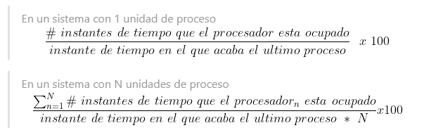
  * **Rendimiento/Productividad (throughput):** nº de procesos que se completan por unidad de tiempo


**Datos de los procesos**

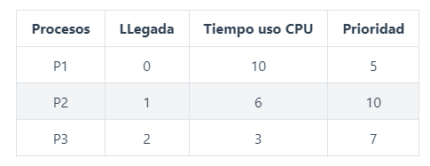

#### FCFS - First Come First Served

- El procesador ejecuta cada proceso hasta que termina o se bloquea.
- Los procesos esperan en la cola.

**1x CPU**


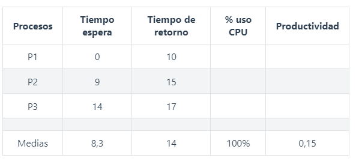

**2x CPU**


**Ejercicios**

**1x CPU**


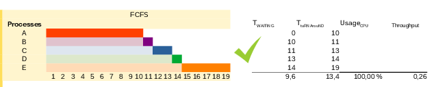
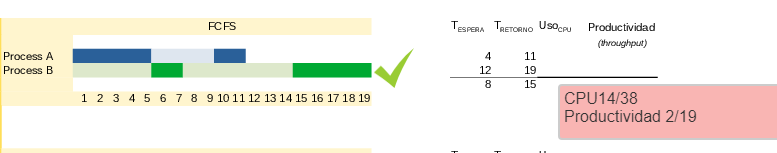

**2x CPU**


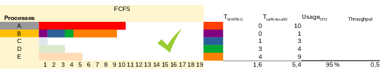
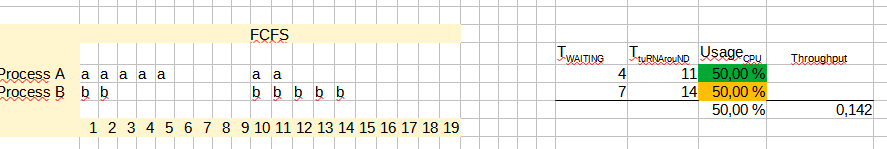

#### SJF - Shortest Job First

- Se priorizan los procesos de menor tamaño independiente de su llegada.
- Riesgo de poner al final de la cola los procesos más largos **inanición**.

**1x CPU**


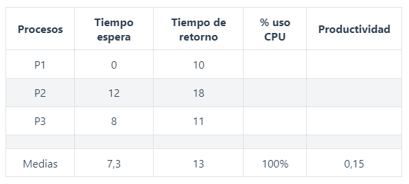

**2x CPU**


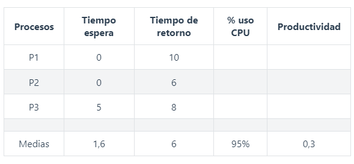

**Ejercicios**

**1x CPU**
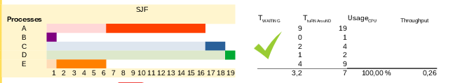
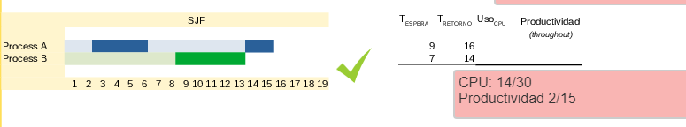

**2x CPU**


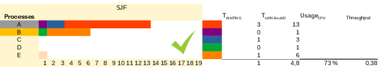
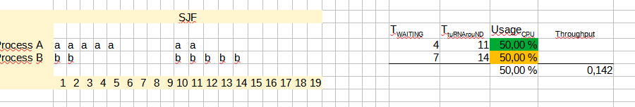


#### Planificación por prioridad

- Cada proceso tiene una prioridad.
- Primero se ejecuta el que tenga mayor prioridad.
- Riesgo de inanición para procesos de baja prioridad.

**1x CPU**


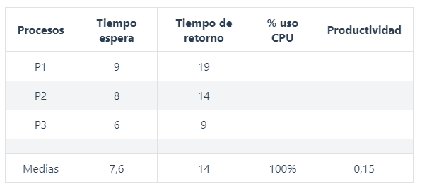

**2x CPU**


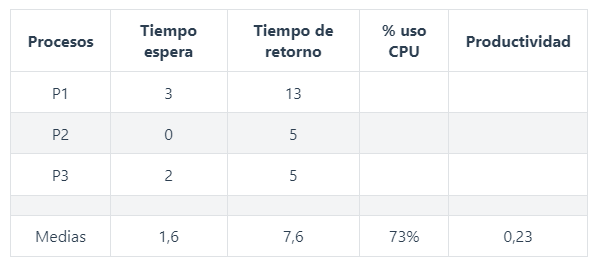

**Ejercicios**

**1x CPU**


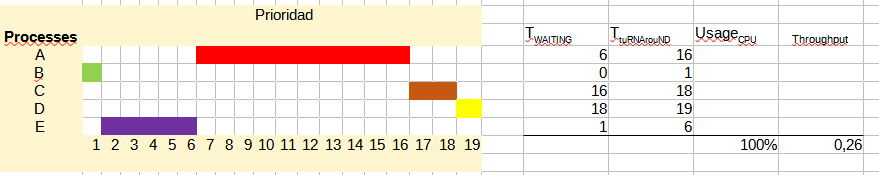

**2x CPU**


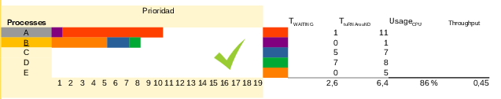
#### Round Robin

- Uno de los más complejos y difíciles de implementar.
- Asigna a cada proceso un quantum.
- Algoritmo circular hasta que termine el proceso.


**1x CPU**


**2x CPU**


**Ejercicios**

**1x CPU**


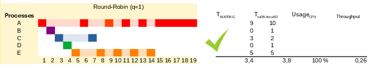
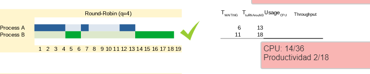


**2x CPU**


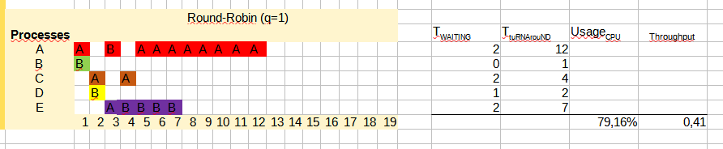
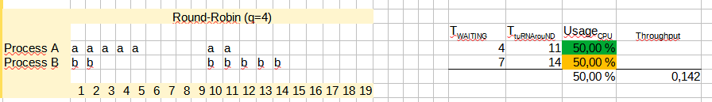
#### Procesos con operaciones de E/S o bloqueos

- Los procesos en determinados momentos deben dejar el procesador para esperar una entrada de usuario, leer o almacenar información...
- Dejando libre el procesador para otros
- Al terminar su espera o bloqueo, vuelve a la cola de preparado.
- **Ejemplo** 2 procesos deben acabar la operación E/S que realiza el proceso 1 para finalizarse.


